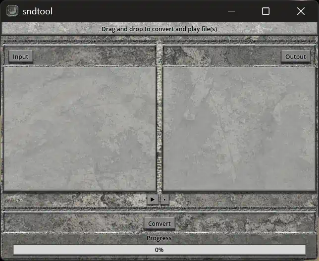
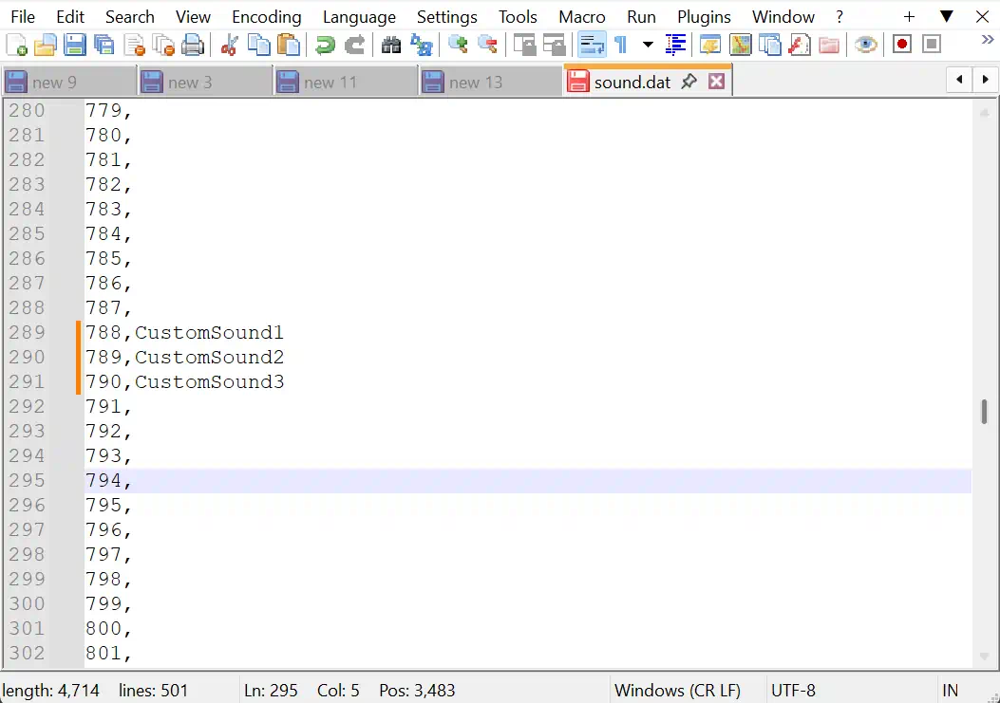

Creating custom sounds for use in SoM used to be a painful process - then, a buggy process. Now, it's a simple process thanks to new community tooling.

## Prerequisites
1. [bbMercy's sndtool](https://github.com/bbMercy/sndtool/releases/tag/Windows)
2. Some plaintext editor (notepad++ recommended, notepad is fine)
3. Some sound editor (Audacity is free, should export WAV in signed 16-bit)

Start by preparing sound effects using your sound editor of choice, after you are done export them in the required format. For regular sound effects - you ideally want to export as mono, 16-bit, 44,100 HZ WAV files.

<figure markdown="span">
  
  <figcaption>SNDTOOL version 1.0</figcaption>
</figure>

After preparing and exporting your sound effects in the required format, drag the files into the **sndtool** window (see above) and click **Convert**. The converted files will be saved in the same directory as the source files, but with the `.snd` file extension.

If you wish to preview your sound effects before converting, select one of the sound effect paths in the window and click the small **▶** button, or simply double-click the path.

After conversion is complete, you will have several `.snd` files. These must be placed into the **SoM Editor** sound directory.

Navigate to your **SoM Editor installation folder**, then open the following path: `data\sound\se\`

Next, locate an empty sound slot. In most cases, the entire **07xx** range is unused and available for custom sounds.

Certain slot ranges are reserved for specific purposes:

- **Event sounds:** Must be within the **500–999** range to be playable inside events.
- **entity sounds:** Can be anywhere from 0-1023.
- **Menu sounds:** Must start at **1008** and are grouped in sets of **four**:

Sounds outside the valid range of **0–1023** cannot be used by SoM.

To add a sound, name the file using the following format: `nnnn.snd`, where `nnnn` is equal to the number of the slot, for example:

- `0788.snd`
- `0789.snd`
- `0790.snd`

After naming it, drag it into the `data\sound\se\` folder.

<figure markdown="span">
  
  <figcaption>Editing sound.dat</figcaption>
</figure>
If you are adding an **event sound** with an ID between **500 and 999**, open the file `sound.dat` in a plain text editor.

Scroll through the file until you find the number matching the slot used for your sound effect. Note that the **leading zero will not appear** in this file. After the slot number and comma, assign a short label for the sound (it is recommended to keep the name concise).