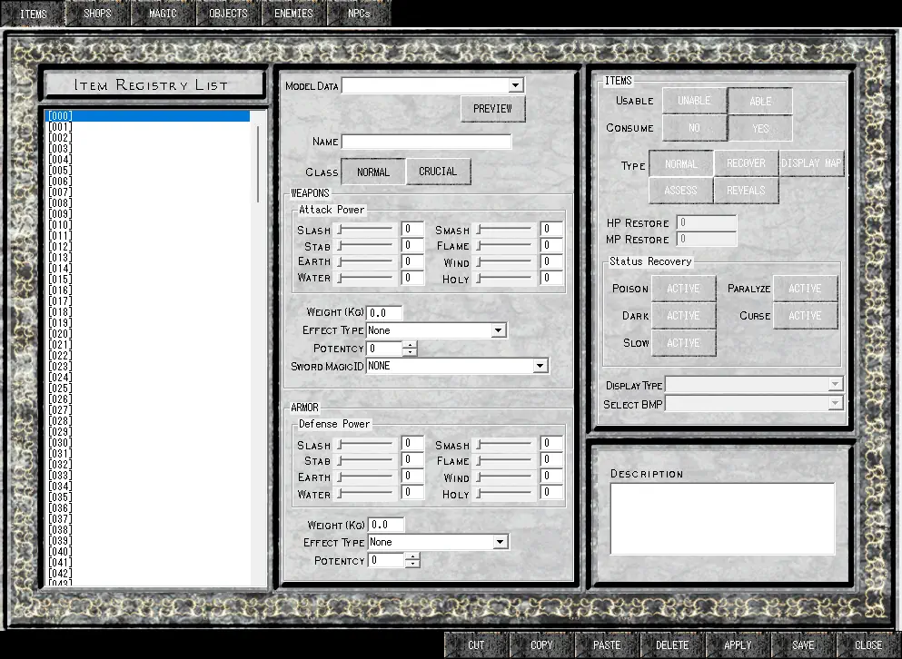

# Parameter Editor - Items

<figure markdown="span">
    
  <figcaption>The 'Items' screen of the Parameter Editor</figcaption>
</figure>
The _Items_ screen of the parameter editor allows you to define the items that you will use to create your game. You are limited to a total of 255 unique items, which can be assigned in the item registry list on the left side of the screen.

### Model Data (Profile Data)
The model data drop-down field is an enumeration of all possible item PRF files available in your current SoM installation. Despite being called "Model Data," it would be more accurate to call it "Profile Data," since these files have other effects on the item definition beyond just the model — in particular, changing the type of item you are defining (weapon, head, body, legs, arms, consumable, etc.). This property cannot be changed without altering the PRF files.

!!! note
    The default models that come with SoM all follow a naming convention. In other words, all weapons are tagged "Weapon:" and chest armor is tagged "Body:" This does not necessarily hold true for custom items, but you will be able to figure out the item model's class by the fields that are accessible once the model is selected.

### Preview
This button allows you to view the 3D model associated with the profile you have selected.

!!! note
    If you have selected a poorly configured PRF file, you may see either a textureless model or nothing at all. It's also worth noting that the preview functionality is extremely temperamental on modern hardware. If you're using a VM install, you should have Direct3D acceleration disabled, which will substantially improve the reliability of the preview function.

### Name
This is the name as displayed in the registery and in game. You are limited to a total of 30 characters.

!!! warning
    Having multiple items with the same name is not recommended. It has been reported that this can cause issues in the final game.

### Class
The class field toggle is used to decide if an item is crucial or not. A crucial item means that it will not be despawned when an item is dropped by an enemy, and the maximum amount of items present in a map has been reached.

!!! tip
    Always set key items to crucial, or you risk the player soft locking!

### Weapons
This grouping will only be active when the profile selected is for a weapon.

### Slash, Smash, Stab, Flame, Earth, Wind, Water and Holy
These are the offensive attributes of the weapon, which are summed together during the damage calculation when the player attacks something with it. They are matched to the traditional 'King's Field II' attribute names, with the only difference being 'Chop' is now 'Smash'.

!!! tip
    If you're developing a traditional KF game inside SoM, it is recommended to use the 'Smash' attribute while defining weapons such as axes or maces.

### Weight (KG)
The weight field allows you to choose how heavy a weapon is, which affects the stamina recovery time of the player while the weapon is equipped, so long as the feature is actually enabled in the System Editor settings.

!!! tip
    The function behind weapon weight in SoM seems to be exponential, meaning it is best to favour a low weight for any starting weapons - or recovery times will be very high.

### Effect Type
The effect type field is used to apply an _effect to the player_ (yes, not the creature you're hitting). The _potency_ field below it is used to define how strong the effect is.

Below is a table of avaliable effects:

| Option | Effect |
|--------|--------|
| Dark | The user screen is dimmed. |
| Curse | Reduces Physical and Magical strength. |
| HP Recover | Recovers _potency_ HP every few seconds. |
| HP Decrease | Reduces _potency_ HP every few seconds. |
| HP Absorb | When an enemy is attacked, some HP is restored. |
| MP Recover | Recovers _potency_ MP every few seconds. |
| MP Decrease | Reduces _potency_ MP every few seconds. |
| MP Absorb | When an enemy is attacked, some MP is restored. |
| Physical Power Increase | Physical strength of the player is increased. |
| Magical Power Increase | Magical strength of the playeri s increased. |
| Poison Resistance | Players resistance to poison is increased. |
| Paralyze Resistance | Players resistance to paralyze is increased. |
| Dark Resistance | Players resistance to dark is increased. |
| Curse Resistance | Players resistance to curse is increased. |
| Slow Resistance | Players resistance to slow is increased. |

### Sword Magic ID
This field allows you to assign a magic (by ID) that the sword is capable of casting.

### Armor
This grouping will only be active when the profile selected is for a piece of armor (helm, body, arms, legs).

Each of these fields will match what the fields for weapons do - however the offensive attributes are now defending attributes, and reduce damage recieved by enemies.

Usage of weight in armor is unknown.

### Items
This grouping will only be active when the profile selected is for an item (usable).

TO-DO.

### Description
This description is accessible in game by creating an access event, which will cause the text written here to be presented to the player.