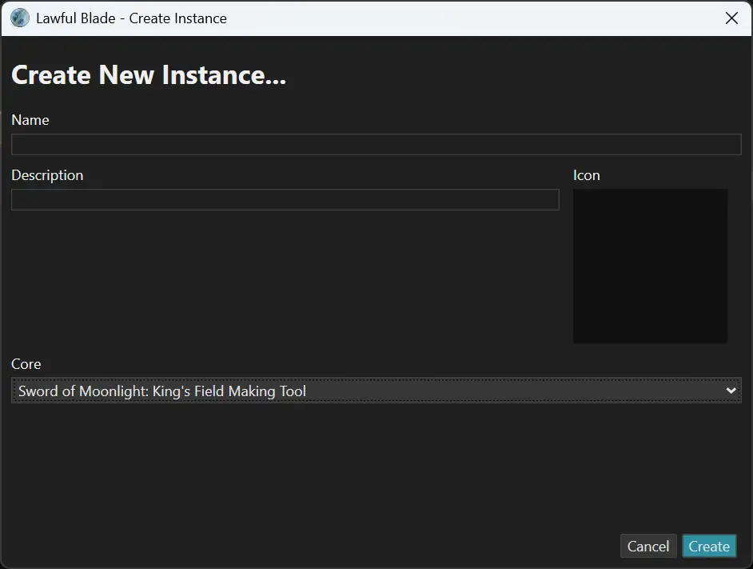
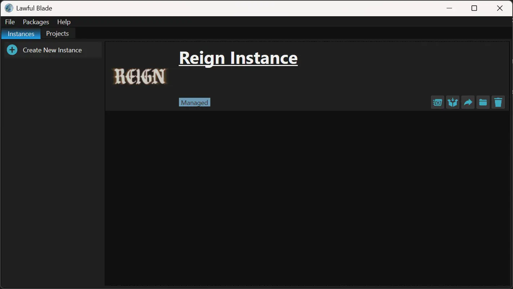

# Lawful Blade - Creating Your First Instance
<figure markdown="span">
    
  <figcaption>The 'Create Instance' Dialog (as it was in Lawful Blade V102)</figcaption>
</figure>
Instances are the bread and butter of Lawful Blade. They are at their core a SoM (or third party editor) installation which is managed by Lawful Blade. This is important when you're using custom content in SoM, since you'll be overriding a lot of files which are part of the editor itself - if you've got multiple projects on the go at one time, you need to have seperate editor enviroments.

### How to do...
You can create a new instance in two ways inside Lawful Blade...

**Option #1**: Through the menu bar. 
Open up the 'File' tab, and hover over 'New...' in the menu that opens. A second menu will open which will allow you to choose the "Instance..." option, which will take you to the dialog shown above.

**Option #2**: Through the 'Instances' tab.
Simply click on the "Create New Instance" button on the left hand side of the window and you will be taken to the dialog shown above.

Below is a brief overview of the fields inside the dialog, and what they do.

### 'Name'
The name field is simply the name you would like to give the instance - it doesn't have to be unique since Lawful Blade differentiates instances by a UUID (don't worry about it) instead of the name. 

### 'Description'
Yet again, this field explains itself. Put whatever you want here, I'd suggest "My awesome (and first) Lawful Blade instance".

### 'Icon'
This one is a little tricky - if you double click the darker box which is below the label, you can choose an image file to use as an icon for the instance which can help you find an instance quickly in the instance list if you've got a large number of them.

### 'Core'
Possibily the most important option here. 'Core' is the primary package which is installed for the instance - it is the editor itself, and absolutely required for an instance. The core package also controls which additional packages are avaliable for an instance.

For now, only the "Sword of Moonlight: King's Field Making Tool" core is avaliable, but in the future you can expect more options.

### Fin.
After you're done, click the "Create" button, which will allow you to operate the main window again. The screen will now display your new instance, which should look a little bit like this:
<figure markdown="span">
    
  <figcaption>The Instances tab of the main Lawful Blade window, with my new instance!</figcaption>
</figure>