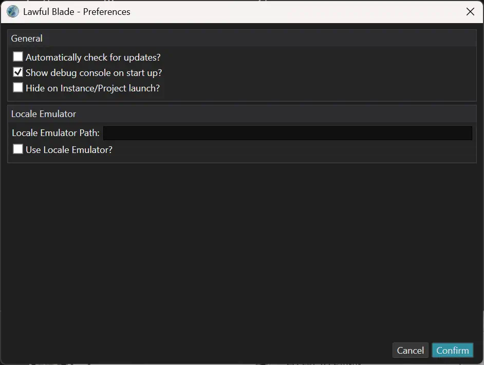

# Lawful Blade - Preferences
<figure markdown="span">
    
  <figcaption>The 'Preferences' Dialog (as it was in Lawful Blade V102)</figcaption>
</figure>
Lawful Blade has a few preferences which you can configure in order to change program operation. This section of the documentation serves to give you a more in depth overview of the different options, and what they do (if the tool tips don't suffice).

Use the image above as reference for what the different sections are referring to.

### _'Automatically Check for Updates?'_
This toggle allows you to control if Lawful Blade will automatically check if a new update is avaliable from the CDN. You might want to disable this feature if you have limited bandwidth, or you're intentionally using an older version of Lawful Blade because some functionality or packages you require were deprecated.

### _'Show Debug Console On Startup?'_
When checked, this toggle will allow Lawful Blade to attach a console to itself on launch, which can be used to diagnose problems with the program, or when performing certain operations such as:

  - Installing packages
  - Publishing projects
  - Creating instance or projects

If you like a less noisey work enviroment, you can disable the console (by default, it is already disabled)

### _'Hide on Instance/Project launch'_
By default Lawful Blade will hide itself when you launch an instance or project, and unhide when any windows of that project or instance have been closed - this is great most of the time, but if you're debugging a problem when publishing your project or authoring some custom assets, you may want to allow Lawful Blade to remain displayed.

Do note that you cannot run multiple projects or instances at the same time due to the nature of how SoM works (it needs specific registry values which Lawful Blade sets when opening a project or instance).

### _'Locale Emulator Path' / 'Use Locale Emulator?'_
This setting allows you to launch SoM using Locale Emulator (which must be installed independently, and won't be covered here.) This is useful when you're running a non translated copy of SoM, since otherwise font alignment and text gets completely screwed up. If you ever encounter a '??????????' error in the English translation patch, you can also use Locale Emulator to make that error display the proper Japanese so you can translate it and try to fix the problem.